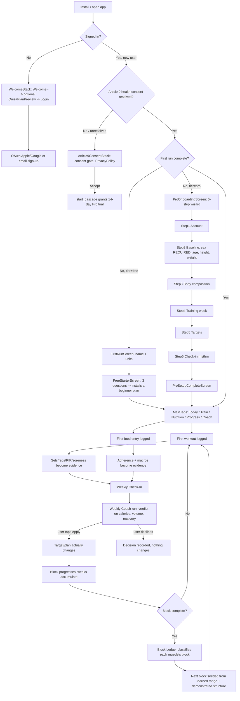
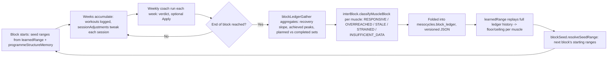
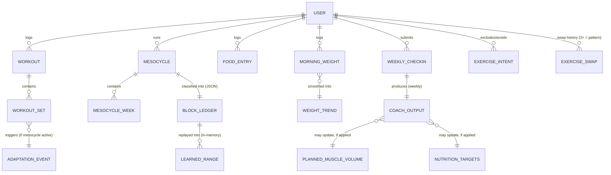
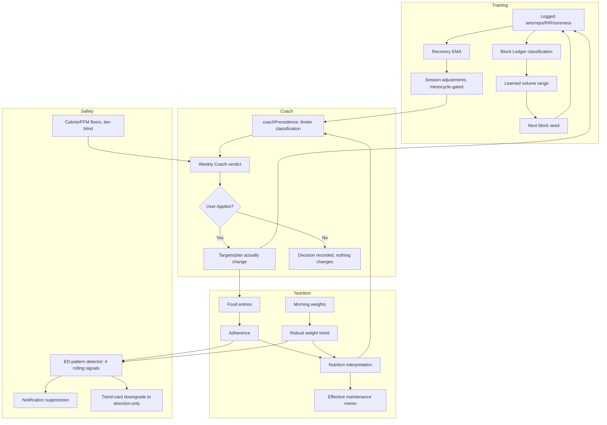

# Volyume — Full Application Product Map

**This document is an evidence-based audit of the live repository, produced by tracing code, not by summarising old planning documents.** Every consequential claim below cites a file path (and usually a line number) that a reader can open and verify. Where a claim could not be fully traced, that is stated explicitly rather than smoothed over. Nothing in this document represents intended, planned, or historically-described behaviour as if it were current unless the current code was actually read and confirms it.

Reachability classification used throughout:
- **LIVE AND USER-REACHABLE** — wired to a screen an ordinary user can reach today.
- **LIVE BUT CONDITIONAL** — reachable, but only once a specific data/state condition is met (e.g. enough weigh-ins, an active mesocycle, Pro tier).
- **BACKGROUND LOGIC** — no direct screen renders it, but a live, reachable screen depends on its output.
- **DORMANT / LEGACY / PARTIAL / UNVERIFIED** — used sparingly below, and always flagged with the reason.

---

## 1. Executive Product Overview

Volyume is a single app that does three things most fitness apps split across three apps: it is a **workout logger**, a **food/nutrition diary**, and a **coach that reads the history those two produce and makes evidence-based suggestions about what should change next.**

The thing that makes it more than "a logger with a coach bolted on" is that the three domains are wired into each other, not stacked side by side. What a user actually logs in the gym (sets, reps, load, effort, soreness) becomes evidence that a training engine reads before deciding whether volume should rise, hold, or ease off next week. What a user eats becomes evidence a nutrition engine reads before deciding whether calories should change — and it will not touch that decision from one bad day; it requires a sustained pattern over multiple weeks. A user's bodyweight is read as a *trend*, not a number, using a statistical smoother that deliberately tells the difference between real, sustained weight change and normal day-to-day water/food-mass noise. All three streams — training evidence, food evidence, weight trend — feed a weekly review that produces one coherent verdict, not three separate charts asking the user to do the synthesis themselves.

The coaching layer in Volyume is **entirely rule-based**. There is no generative AI, no LLM, and no black-box model deciding what to change. Every "intelligent" behaviour documented in this file is one of: a documented formula (Mifflin-St Jeor/Katch-McArdle BMR, a specific research-cited energy floor), a deterministic lookup table (volume landmarks by training-experience tier), a statistical smoother with a named, quotable formula (a Huber-clamped exponentially-weighted moving average), or an explicit precedence rule a developer wrote and a test pins ("a calorie change requires 2–3 consecutive off-target weeks, never one weigh-in"). The one place actual machine learning appears — Progress Scan, a photo-based leanness estimator — runs a small on-device segmentation model and is exhaustively documented (§13) as explicitly *not* a body-fat measurement, with the image never leaving the device.

What remains under direct user control is deliberately large. The coach never silently changes a plan or a target: every material coaching decision surfaces as a proposal with an Apply button (`src/lib/coachApply.js:1-18` — "nothing changes until the user taps... no silent auto-apply"), and the app tracks whether the user accepted or declined each specific proposal. Exercise substitutions, calorie targets, and training volume are all explicit-consent surfaces, not automated mutations.

The product becomes more useful with time because nearly every coaching decision in Volyume requires *evidence*, and evidence only accumulates through use. A brand-new user gets research-default volume landmarks and a formula-based calorie target; a six-month user gets volume ranges shaped by their own demonstrated recovery pattern (`src/lib/learnedRange.js`), a maintenance-calorie estimate learned from real logged intake rather than a formula (`src/lib/effectiveMaintenance.js`), and a training plan whose day-structure is biased by the split they've actually been running (`src/lib/planAutoGen.js:178`, `readDemonstratedStructure`).

---

## 2. Complete User Journey



Key branch points confirmed in code:
- **No anonymous mode exists at all.** `src/navigation/RootNavigator.js:1202-1209` explicitly enforces this, citing `docs/IDENTITY_AND_OWNERSHIP_LOCKED.md`, and it is mechanically guarded by `scripts/check-identity-invariant.sh`.
- **Sex must be explicitly chosen at onboarding — it can never default.** `ProOnboardingScreen.js` step 2 state starts as `useState(null)`, `advanceFrom2` blocks progression unless `sex === 'male' || sex === 'female'`, and even a restored in-progress draft with invalid/missing sex clamps the wizard back to step 2. Pinned by `src/lib/__tests__/proOnboarding.sexGate.test.js`. Reason: sex drives the calorie floor and BMR formula, both safety-relevant.
- **The consent gate fails closed on a transient error, not open.** A read failure or RPC error sets `healthConsent` to `null` (unresolved), never `false` — because `false` re-triggers the un-skippable gate even for an already-consented user. Pinned by `src/__tests__/healthConsentRouting.guard.test.js`.
- **The Article 9 consent screen is where the 14-day Pro trial actually starts** (`start_cascade`), not at account creation.
- **Meal renaming (`MealNamesScreen.js`) is a real, working screen that is deliberately unreachable** — its Settings entry point was removed by founder order but the screen kept "in case meal renaming returns" (`RootNavigator.js:547-551`). This is the one confirmed case of a fully-built, currently-orphaned screen.

---

## 3. Screen & Navigation Inventory

There are **82 files in `src/screens/`**; one (`paywallExcerpts.js`) is a data module, not a screen, giving **81 real screens**, all of which are registered under some `Stack.Screen` in `src/navigation/RootNavigator.js` — no screen file was found with zero navigator registration.

### 3.1 Root routing gate order (`RootNavigator.js`, `renderNavigator()`)

1. DB init failure → inline recovery view (not a nav stack).
2. `!user` → `WelcomeStack`.
3. Signed-in, first run not done, consent not yet checked → `SplashScreen` (prevents a flash of onboarding before consent/trial resolve).
4. Consent refused or unresolved for a new user → `Article9ConsentStack`.
5. `!firstRunComplete` → `tier==='pro' ? ProOnboardingStack : FirstRunStack`.
6. Else → `LockedMainTabs` (MainTabs behind the opt-in biometric lock overlay).

A separate pre-gate, `src/lib/authBootGate.js` (`classifyAuthBoot`), sits in front of all of this: while auth state is resolving it shows a neutral splash and never speculatively renders logged-out or tier-specific UI — a documented product law in the file's own header comment.

### 3.2 MainTabs (5 tabs, internal id → visible label)

| Tab id | Visible label | Stack |
|---|---|---|
| `HomeTab` | **Today** | Home, BuildWorkout, ActiveWorkout, WorkoutSummary, WorkoutHistory, ShareCard, CoachReview, ProUpgrade, FreeStarter |
| `PlansTab` | **Train** | Plans, PlanUpdate (Pro), PlanDetail, RoutineDetail, ExerciseDetail, ManualBuilder, PlanLibrary, MesocycleBuilder, AvoidedMovements, ProUpgrade, FreeStarter |
| `DiaryTab` | **Nutrition** | Diary (Pro, read-only-gated for free), MealPlan (Pro), FoodSearch (Pro), AddCustomFood (Pro), ScanBarcode (Pro), ScanLabel (Pro), FoodInsights (Pro), MyRecipes (Pro), MyMeals (Pro), RecipeBuilder (Pro), ProUpgrade |
| `ProgressTab` | **Progress** | Analytics, WorkoutHistory, WorkoutSummary, VolumeHeatmap, BodyMetrics (Pro read-only-gated), ProgressPhotos (Pro read-only-gated), LiftProgress, Consistency, Partner (Pro), ExerciseDetail, YearOfLifts, ShareCard, ProUpgrade |
| `ProfileTab` | **Coach** | You, AthleteProfile, Settings (+10 sub-screens), NutritionTargets (Pro), MealNames (Pro, orphaned), NutritionEducation, BodyMetrics, ProgressPhotos, WeeklyCheckIn (Pro), CoachOutput (Pro), WeeklyStory (Pro), Methodology, CoachHeldHistory, BlockReflection, ProGoalSetup (Pro), GoalChangeSummary, GoalLockConsent, NotificationSettings, Import, CoachingReminders (Pro), WellbeingCheck, PrivacyPolicy, DebugLog (dev-only), SubscriptionPolicy, Subscription, CascadeGate, Credits, ProUpgrade |

"Read-only-gated" (`withReadOnlyProGuard`) means a free user can *view* their own historical Body Metrics / Progress Photos data if they have any, but cannot add new entries — distinct from a hard `withProGuard` block.

### 3.3 Deep links (`RootNavigator.js:758-817`)

| Link | Destination |
|---|---|
| `volyume://workout/start` | BuildWorkout |
| `volyume://diary(/:date)` | Diary |
| `volyume://routine/:planId` | PlanDetail |
| `volyume://progress` | Analytics |
| `volyume://coach` | CoachOutput |
| `volyume://checkin` | WeeklyCheckIn |

Pro-gated destinations reached via deep link still render their upgrade prompt for a free user — the gate is never bypassed by the link.

### 3.4 Core-journey screens (verified line-by-line)

| Screen | Purpose | Pro-gated | Reachability |
|---|---|---|---|
| WelcomeScreen.js | Unauthenticated landing | N | WelcomeStack |
| LoginScreen.js | OAuth + email sign-in/up | N | WelcomeStack |
| QuizScreen.js / PlanPreviewScreen.js | Pre-account quiz + plan reveal | N | WelcomeStack, feature-flag gated (`ONBOARDING_QUIZ_FIRST`) |
| FirstRunScreen.js | Free onboarding: name + units | N | FirstRunStack |
| FreeStarterScreen.js | 3-question guided starter plan | N | FirstRunStack |
| Article9ConsentScreen.js | Health-data consent, trial start | N | Article9ConsentStack |
| ProOnboardingScreen.js | 6-step Pro wizard | N (pre-purchase) | ProOnboardingStack |
| HomeScreen.js | Today tab root | N | MainTabs |
| ActiveWorkoutScreen.js | Live workout logger | N | HomeStack |
| DiaryScreen.js | Food diary | Y (read-only guard) | DiaryStack |
| WeeklyCheckInScreen.js | Weekly check-in input | Y | ProfileStack |
| CoachOutputScreen.js | Coaching verdict + Apply | Y | ProfileStack; deep link `coach` |
| BodyMetricsScreen.js | Weight/measurement log | Y (read-only guard) | ProgressStack |
| ProgressPhotosScreen.js | Photos + Volyume Score | Y (read-only guard) | ProgressStack |
| VolumeHeatmapScreen.js | Per-muscle volume, manual landmark edit | N | ProgressStack |
| ProUpgradeScreen.js | Main paywall | N (it is the paywall) | Modal in every tab stack |
| CascadeGateScreen.js | Trial-end/lapse purchase sheet | N (it is the paywall) | Home, Subscription, notification tap |

### 3.5 Legacy / dev-only / unreachable findings

- **`MealNamesScreen.js`** — confirmed dead route, deliberately retained (see §2).
- **`DebugLogScreen.js`** — dev-only, reachable only via a `__DEV__`-gated long-press in Settings → About.
- Prior cleanup already removed several unreachable pre-B2 onboarding registrations (documented in `RootNavigator.js` comments as "D95/AUDIT-ROUTES 5.7") — i.e. the navigator has already had one dead-route sweep; the audit found only `MealNamesScreen` still orphaned today.

---

## 4. Training System — Complete Product Map

### 4.1 Programme structure

A plan is generated by `src/lib/planEngine.js` (`generatePlan`, 3553-line module) from: experience, days/week, session length, equipment, goal, phase, weak points, recovery rating, nutrition phase, age, and — for a returning user — `programmeStructureMemory`, the split/day-count they've actually demonstrated in prior blocks (`src/lib/planAutoGen.js:178`, `readDemonstratedStructure`). Exercise selection (`selectExercisesForMuscle`, line 1415) applies deterministic caps (max 4 compound + 3 isolation per muscle) and a subregion-coverage requirement table, plus a superset-compatibility scorer. None of this is statistical or ML — it is rule-based lookup and scoring, verified by direct code read.

### 4.2 Volume landmarks: MEV / MAV / MRV

Three layers, resolved in strict precedence (`src/lib/effectiveLandmarks.js:41-70`):

1. **Manual** — the user's own hand-edited values (VolumeHeatmapScreen), only counted if a real edit is detected (guards against a legacy bug where saving the whole table looked like an edit and silently disabled learning for every muscle).
2. **Adapted** — a Pro-only, session-grain adjustment requiring 3+ data points (`effectiveLandmarks.js:151`).
3. **Research** — the static default table.

A **separate, slower, block-grain memory** exists in `src/lib/learnedRange.js`: it replays the user's Block Ledger history (see §6) into a floor/ceiling per muscle. The ceiling can rise at most 2 sets per block, tracking toward the highest volume the muscle has ever handled *while responding well*; a bad block (overreached/strained) pulls it back down; a "stale" block (no real signal) never moves it. The floor only ever moves *down*, at most 1 set per block, because "not trying lower volumes is not evidence they fail" (`learnedRange.js:33-36`, quoted directly). This is explicitly a **pure replay** of history, not a parallel statistical store — same history always produces the same range. Hard clamps: research MEV is an absolute floor no learning can go below; the ceiling never exceeds a hard-coded 30-sets-per-week absolute cap or the Pro adapted MRV. Entries logged under calm-mode or an open ED flag never teach the engine and never raise the ceiling.

**Classification:** Manual/research always LIVE; Pro session-adapted LIVE BUT CONDITIONAL; block-grain learned range LIVE BUT CONDITIONAL (needs at least one completed, classified block — a brand-new user sees nothing learned yet).

### 4.3 The workout log itself

A session flows through `ActiveWorkoutScreen.js`: planned exercise with recent-performance recall, set logging (weight/reps/RIR/effort), rest timer, unilateral handling, in-session substitution, and completion. Every logged set becomes the evidence that later feeds `sessionAdjustments.js`, `blockLedgerGather.js`, and the weekly coach.

### 4.4 Block/mesocycle lifecycle

`src/lib/mesocycle.js` provides the deterministic scheduling math (current week, block-week index, schedule) plus a rule-based autoregulation evaluator (`evaluateAutoReg`) and deload predictor (`predictDeloadWeek`) over a feedback window of fatigue/soreness/joint-pain — again rule-based thresholds, not ML. `getBlockStatus`/`blockCompletionState` implement a formal state machine (`BLOCK_COMPLETION` enum) for block lifecycle.

`src/lib/blockProgression.js` resolves, for each planned session, one of a fixed set of outcomes (completed / skipped / ended-early / rescheduled) via an explicit precedence array when more than one resolution row exists — last-write-wins-with-precedence, persisted to `session_resolutions`.

### 4.5 Deload / recovery weeks

`src/lib/recoveryState.js` (`resolveRecoveryState`) is a pure function distinguishing three states: `NORMAL_ACCUMULATION`, `PLANNED_BLOCK_RECOVERY` (the block's own scheduled deload, unconditional), and `ADAPTIVE_RECOVERY_ADJUSTMENT` (an evidence-driven easing mid-block, set only via a real coach apply flow — `recoveryState.js` comment: "runs from the coach's explicit recovery-driven apply and nowhere else"). Position beats calendar: if the accumulation-phase's final hard session is still outstanding, the state stays `NORMAL_ACCUMULATION` even if the calendar has reached the scheduled deload week — a fix for a specific founder-reported failure mode documented directly in the code.

---

## 5. Training Coach / Adaptive Intelligence

**What is actually intelligent about the training coach?** Every input, every output, and the precedence between them, traced below.

### 5.1 Inputs available to the coach, and their lifespan

| Input | Origin | Persists as | Affects |
|---|---|---|---|
| Completed sets/reps/load/RIR | `ActiveWorkoutScreen` | `workout_sets` | current session, session adjustments, block ledger |
| Soreness / fatigue / joint discomfort | Workout log fields | `workouts.soreness24hBefore` etc. | recovery EMA (7-day half-life), readiness chip |
| Weekly check-in (energy, adherence, training performance) | `WeeklyCheckInScreen` | `weekly_checkins` | weekly coach run |
| PR events | detected on log | milestone tables | best-lift-of-week, motivation surfaces |
| Session resolution (missed/skipped/rescheduled) | derived + logged | `session_resolutions` | block progression |
| Manual volume override | VolumeHeatmapScreen | AsyncStorage, per-user | overrides adapted/research landmarks for that muscle |
| Exercise exclusion / avoidance | avoidance UI | `exercise_intent` | future plan generation and swap suggestions only, never rewrites past history |
| Swap history (3+ repeats) | logged swaps | `exercise_swaps` | detected as a genuine preference pattern |
| Block ledger classification | end-of-block | `mesocycles.block_ledger` (JSON, versioned) | next block's seed range |

### 5.2 What the coach can decide (outputs)

`src/lib/weeklyCoach.js` (`runWeeklyCoach`, 2613-line module, single entry point) produces one weekly verdict object persisted to `coach_outputs`: `volume_signal`, `load_signal`, `recovery_flag`, `calorie_change`, `steps_target`, `cardio_prescription`, plus a `why_this` explanation. The function is documented and tested as pure — identical inputs plus the same clock reading give byte-identical output (`weeklyCoach.js:622-626`).

**Nothing here is machine learning.** The trend math is a fixed-alpha (default 0.1) exponentially-weighted moving average — a named, quotable recursive filter, not a trained model. Confidence is a rule-based ladder (low/medium/high), not a probability from a classifier.

### 5.3 Decision hierarchy — derived from code, not asserted

`src/lib/coachPrecedence.js` is the single place this is enforced, and its own header states the founder law directly:

> "poor body-weight progress + low calorie adherence must NOT immediately mean increase calories" and "poor gym performance + poor training adherence must NOT immediately mean replace exercises or rebuild the programme."

The mechanism:
1. Each domain (nutrition, training) is independently classified into a `LIMITER`: `PLAN` (the programme itself is the limiting factor), `EXECUTION` (the user didn't do what was asked), `RECOVERY`, or `INSUFFICIENT_EVIDENCE`.
2. Each limiter maps to the *largest allowed* intervention on a fixed ladder: `NONE < EXPLAIN < PRESCRIPTION < EXERCISE < VOLUME < NUTRITION_TARGET < STRUCTURE`.
3. A cross-domain **coordination gate** (`coordinateChanges`) then sits across the two domains' already-computed real proposals and can only **withhold**, never create or enlarge a change:
   - **R1**: a calorie change is disallowed (unless it's a safety correction) if the nutrition limiter is EXECUTION — the target wasn't actually eaten, so raising/lowering the number wouldn't fix anything.
   - **R2**: a volume *increase* is disallowed if the training limiter is EXECUTION (sessions missed) or RECOVERY (recovery calls for restraint). Volume decreases are never withheld this way.
   - **R3**: if both domains would otherwise change but one's evidence is only INSUFFICIENT_EVIDENCE-level, that weaker one is withheld — quoted directly: "do not change training AND nutrition simultaneously merely because both engines found weak evidence."
4. Causal claims are permanently forbidden regardless of correlation — `neverClaim: ['nutrition_caused_training_outcome', 'training_caused_weight_outcome']` is hard-coded.

**User instruction and manual override sit above all of this.** A manual landmark edit is only overridden by nothing — it is the top of the volume-landmark precedence chain (§4.2). Applying or declining a coach proposal is an explicit, per-field, logged action (`markApplied`/`markDeclined` in `coachApply.js`), not a background mutation.

### 5.4 Persistence — what the coach remembers after…

- **One set:** nothing on its own; it becomes part of the session's evidence.
- **One session:** feeds the recovery EMA (7-day half-life) and, if a mesocycle is active, `sessionAdjustments.computeAndLogSessionAdjustments` logs a per-session tweak (±1 set / ~5% load, downward-only, from a fixed readiness-rule table) to the `adaptation_events` audit trail.
- **One week:** the weekly coach run persists one `coach_outputs` row; applying it can move `mesocycle_weeks`/`planned_muscle_volume` targets for the rest of the current block.
- **One block:** `interBlock.classifyMuscleBlock` classifies each muscle's outcome (`RESPONSIVE`, `OVERREACHED`, `STALE`, `STRAINED`, `INSUFFICIENT_DATA`) and folds it into `mesocycles.block_ledger`.
- **Multiple blocks:** `learnedRange.computeLearnedRange` replays the full ledger history into a per-muscle floor/ceiling that seeds the next block, and `planAutoGen.readDemonstratedStructure` biases the next plan's day-structure toward the split the user has actually run.

### 5.5 Concrete adaptation examples (from real code paths, not invented)

- **A user repeatedly completes all chest work comfortably and recovers well.** Each completed block classifies chest as `RESPONSIVE` in the block ledger. `learnedRange` moves the chest ceiling up by up to 2 sets, tracking toward the highest volume it has proven it can handle. The next block's seed range for chest starts higher than the research default. Nothing changes mid-block from this alone — it only affects the *next* block's starting point.
- **A user's quadriceps soreness stays elevated while performance deteriorates.** The recovery EMA for quads trends up; if a weekly check-in also shows poor training performance, `coachPrecedence` classifies the training limiter as `RECOVERY`. Per rule R2, a volume *increase* for quads is withheld this week regardless of what the raw progression math might otherwise suggest. If the block classifies quads as `OVERREACHED` or `STRAINED` at block-end, the next block's seed ceiling for quads is pulled down toward the achieved peak minus 2, or back to the block's starting sets.
- **A user manually overrides an adaptive recommendation** (edits a landmark by hand in VolumeHeatmapScreen, or declines a coach proposal). The manual value sits at the top of the landmark precedence chain and is not overwritten by adapted or research values. A declined coach proposal is recorded via `markDeclined` against that specific field — it does not silently retry, and entries logged under an explicit override (`deferredToManual`) never feed the learned-range engine, i.e. an override doesn't get quietly "corrected" back by learning.

---

## 6. Mesocycle / Training Block Engine



Volyume avoids treating each new block as if it has never seen the user before: the seed ranges for a new block are explicitly built from the accumulated ledger (`blockLedgerRunner.buildSeedRangesForNextBlock`), not reset to research defaults. The one deliberate exception is a **stale-evidence window** — `interBlock.js` defines `STALE_EVIDENCE_WEEKS = 4`; a muscle with no recent qualifying evidence is classified `INSUFFICIENT_DATA` rather than having old evidence stretched indefinitely.

Fallback hierarchy when there is no block history yet (a first-ever block, or a genuinely fresh muscle group): manual override → prior block's learned range (if present) → research defaults. This chain is read directly from `blockSeed.resolveSeedRange`.

---

## 7. Exercise Intelligence, Preference & Individualisation

- **Library and selection**: `planEngine.js` builds each plan's exercise pool via `poolGenerator.js` from a metadata-rich exercise library (muscle targets, equipment, movement pattern, compound/isolation).
- **Swap scoring** (`src/lib/swapEngine.js`): a pure, additive weighted scorer — same primary muscle (+40), same subregion (+25), same movement pattern (+20), same equipment (+15), same compound/isolation type (+10), similar fatigue cost (+10), similar stimulus-to-fatigue ratio (+10). No database writes happen inside this module; it is pure ranking plus a short plain-English "why this?" reason string.
- **Exclusion and avoidance memory**: `src/lib/exercise/intent.js` is the canonical read layer every selecting surface consults, merging five evidence sources (intents, swaps, slot defaults, usage stats, progression sessions) in one load. Its own architecture doc states the governing law plainly: *"Explicit user intent outranks anything inferred. An exclusion beats swap history; an approved default beats a counted preference."* An exclusion is only ever about *future* suggestions — it never rewrites what already happened. This invariant is pinned by a source-level regression test (`campaign9.intent.test.js`) that specifically guards `intent.js` from ever containing a database *write* — writes were deliberately split out into a separate file, `src/lib/exercise/movementConstraints.js`, precisely so the "read layer never writes" claim stays testable.
- **Pattern-level avoidance** (`movementConstraints.js`): a user can avoid a movement family for a fixed number of days, for the rest of the current block, or indefinitely.
- **Preference learning threshold**: a swap is only recognised as a genuine, repeatable preference after **3 repetitions of the same swap** (`REPEATED_SWAP_MIN = 3`) — a deterministic count, not a probabilistic inference.
- **Safeguard against silent changes**: every one of these mechanisms only affects *future suggestions/generation* — none of them retroactively edits a logged workout, and every swap/exclusion is a screen-driven, explicit user action, never a background write triggered by inference alone.

---

## 8. Nutrition System — Complete Product Map

### 8.1 Targets

`src/lib/nutritionEngine.js` computes BMR via **Katch-McArdle** when a credible body-fat reading exists (`lbm = weight × (1 − bf%/100); BMR = 370 + 21.6 × lbm`), or **Mifflin-St Jeor** otherwise:
- Male: `10×weight + 6.25×height − 5×age + 5`
- Female: `10×weight + 6.25×height − 5×age − 161`

TDEE multiplies BMR by an activity factor, deliberately tuned 200–400 kcal/day below textbook Mifflin/Katch multipliers per constrained-TDEE literature (code comment, `nutritionEngine.js:17-20`).

Macros: protein first (floor-guarded), fat next at a per-goal g/kg rate (floored at the greater of 0.5 g/kg or 40 g, "keeps fat at hormonal minimum"), carbs as the remainder. Meal frequency defaults to 5 for an aggressive cut, 4 otherwise, citing the leucine-threshold research directly in comments.

### 8.2 Food logging technology

`src/lib/food/db.js` (2,174 lines) is the local schema/CRUD layer: food entries, daily rollups, recent/frequent foods, custom foods (including barcode EAN), favourites, water, recipes, saved meals, meal plans.

**Food data waterfall** (`src/lib/food/waterfall.js`), first-hit-wins, five steps:
1. Local SQLite cache
2. Bundled OpenFoodFacts snapshot
3. Bundled CoFID (UK composition database) snapshot
4. **Live OpenFoodFacts API** (`src/lib/food/sources/liveOff.js`, 1200ms timeout)
5. **Live USDA FoodData Central API** (`src/lib/food/sources/usda.js`, 1500ms timeout)

The USDA step requires `EXPO_PUBLIC_USDA_API_KEY` at build time; if unset it silently short-circuits to no results — so USDA coverage is **LIVE BUT CONDITIONAL** on build configuration, not guaranteed present in every build. A live hit from either remote source is cache-promoted back into the local `foods` table so it doesn't need a network round-trip next time.

### 8.3 Nutrition intelligence — what Volyume actually decides about food, not just records

`src/lib/weeklyCoach.js` gates a calorie *change* behind a real evidence requirement:

```js
const canAdjustCals = (
  !cycleOverride && !scoffPositive && currentCalTarget != null &&
  (calsAdherence !== 'untracked' || foodDiaryStandsIn) &&
  ( rapidLossOverride ||
    ( consecutiveOffTargetWeeks >= offTargetWeeksRequired &&
      lastCalAdjustmentWeeksAgo >= 2 ) )
);
```

`offTargetWeeksRequired` is **2 weeks at high confidence, 3 at lower confidence**, plus a hard 2-week cooldown since the last change. In plain terms: Volyume will not react to one bad or good weigh-in. It requires 2–3 consecutive weeks of the weight trend disagreeing with the goal, and at least two weeks since the last calorie change, before it will suggest another one. The **one deliberate exception** is a rapid-loss safety bypass: if trend loss exceeds 1.5%/week *and* self-reported energy is low, the cooldown and off-target-weeks requirements are both skipped so calories can be raised immediately — and this bypass is explicitly upward-only; the same condition during a bulk phase does not compress the downward gate.

When a change does fire, the base step is a fixed ±100–150 kcal, then resized by an **adaptive TDEE adjustment** once 14+ morning-weight entries and a maintenance estimate exist — but this resizing only ever amplifies or dampens the direction the simple off-target rule already chose; it never reverses it, and it is always bounded by the FFM floor and rapid-loss caps below.

### 8.4 Safety floors — the numbers, and where they're enforced

| Guardrail | Value | Source |
|---|---|---|
| Calorie floor, male | **1,500 kcal** | `nutritionEngine.js:721-723`, re-enforced in `coachApply.js` |
| Calorie floor, female | **1,200 kcal** | same; unknown sex takes the higher (1500) floor by design |
| FFM energy floor | **30 kcal/kg fat-free mass/day** | `nutritionEngine.js:127`, citing Mountjoy 2014/2023 IOC RED-S consensus |
| Max advisory loss rate | **0.8% bodyweight/week** | soft warning only |
| Hard rapid-loss gate | **1.5% bodyweight/week** | target is force-raised to cap the deficit at this rate |

The FFM floor is enforced in `computeAdaptiveTDEEAdjustment`: once average logged intake over the last 7 days sits at or below the FFM floor and the adaptive adjustment would still push down, the cut is refused outright and a user-facing `floorHeld` message is shown. A code comment in `coachApply.js` documents a real bug this floor logic once had — the apply path used to floor everyone at the female number (1,200), which could let a male's target fall below his 1,500 floor — and states the fix explicitly re-exports one single `kcalFloorForSex` source of truth to prevent that drift recurring.

**What Volyume does NOT do here**: it never lowers these floors, never makes them conditional on tier (the guardrails are explicitly tier-blind per `proGate.js`), and there is no separate "aggressive mode" that bypasses them.

### 8.5 Meal planning

`src/lib/planAutoGen.js` and an adjacent cluster (`mealPlanAssembler.js`, `mealSuggest.js`, `mealSwap.js`, `mealRationale.js`, `groceryList.js`, `recipeImport.js`) exist and are substantial, but were **not read in full during this audit** — flagged as UNVERIFIED rather than described from filenames alone.

---

## 9. Nutrition Coach / Food Intelligence

Covered above (§8.3–8.4). To restate the core distinction plainly: **Volyume decides very little about food automatically.** It records everything precisely, computes a target from a documented formula, and will suggest a *change* to that target only after a sustained, multi-week pattern of the weight trend disagreeing with the goal — never from a single data point, and never below a hard, sex-aware, research-cited floor.

---

## 10. Food Data & Food Logging Technology

Covered in §8.2. Summary table:

| Layer | Source | Notes |
|---|---|---|
| Local cache | SQLite `foods` table | fastest, always checked first |
| Bundled snapshot | OpenFoodFacts export | ships with the app, works fully offline |
| Bundled snapshot | UK CoFID export | ships with the app |
| Live API | OpenFoodFacts | 1200ms timeout, cache-promoted on hit |
| Live API | USDA FoodData Central | 1500ms timeout, requires build-time API key, silently absent without one |

---

## 11. Bodyweight, Body Metrics & Trend Intelligence

`src/lib/robustTrend.js` implements two distinct smoothers, deliberately kept separate:

1. **Display smoother** (`robustEwma`) — an asymmetric Huber-clamped EWMA. Formula: scale `s = max(0.25 kg, 1.4826 × MAD of the last 14 innovations)`; the clamp knee is `1.5×s` for upward moves (tightly damps a water-weight spike) but `4×s` for downward moves (passes real weight loss through almost undamped). Code comment states the reason directly: the ED/rapid-loss safety detectors deliberately read the *less*-damped series, because smoothing must never mask a genuine rapid loss.
2. **Decision-tracking smoother** (`robustTrackingEwma`) — a Holt's-linear (level + trend) variant used only where the weekly coach makes an off-target *decision*, built after the plain display smoother was found to over-damp sustained trends and broke a "fast bulk" test simulation.

This is **not a simple moving average**: MAD (median absolute deviation) is used instead of standard deviation specifically because it resists being dragged by a single outlier weigh-in, and a single non-positive or corrupt entry is dropped outright rather than allowed to fake a rapid-loss signal.

**Minimum observations, enforced as a UI state ladder** (`weightTrend.js`): fewer than 1 entry → card doesn't render; 1–6 entries → "log for 7 days," no rate shown; 7–13 → "still building confidence," still no rate; 14–41 → full interpretation with rate; 42+ → full interpretation. A 7-days-ago comparison explicitly returns `null` rather than scaling a 2–4 day span up to a weekly rate — a directly-cited anti-overstatement fix.

Under an open ED flag or calm mode, the trend card drops to **direction-only** copy ("rising slightly" / "broadly stable") — no numeric rate, no maintenance estimate, no coloured indicator.

---

## 12. Progress System

Progress in Volyume spans: bodyweight trend (§11), strength/PRs (§4, §12.1), training volume and consistency, adherence, progress photos, and Progress Scan (§13). Communication is deliberately hedged where data is thin — the same "not enough data yet" state ladder used for weight applies conceptually across these surfaces, and Progress Scan in particular refuses to show a numeric score at all below a confidence threshold rather than showing a falsely-precise number.

### 12.1 PRs and strength standards

`src/lib/strengthStandards.js` provides bodyweight-multiple standards for five barbell compounds across five tiers (Beginner→Elite), sourced explicitly in-code from strengthlevel.com and symmetricstrength.com, and is **deliberately gender-neutral** — the code comment states plainly this makes the standards "general orientation rather than a precise verdict," despite the app collecting sex elsewhere.

`src/lib/bestLift.js` picks a "best lift of the week" for the recap card by preferring the biggest genuine estimated-1RM *gain* over the prior best — not raw heaviness — so both lighter and heavier lifters get a fair win, explicitly unified with the same 1RM calculation the live PR detector uses so the featured lift never disagrees with the weekly PR count. Suppressed entirely under an open ED flag or calm mode, per its own header comment, and never compared against other users.

---

## 13. Progress Scan / Image Intelligence

This is the one place actual on-device machine learning runs, and it deserves the same forensic treatment the audit brief asked for.

### 13.1 Capture and model

A Progress Scan photo is processed by a bundled **TFLite MediaPipe Selfie Segmentation model** (`react-native-fast-tflite`), with a native **ML Kit Selfie Segmentation** fallback (`modules/progress-scan-image`) — both **fully on-device**. A repository-wide search across the Progress Scan code and the native module found **no network call transmitting an image anywhere**; the only network-shaped strings found were unrelated URL-scheme checks and a podspec homepage. The code itself states the guarantee directly: `progressScanCheckInEvidence.js:577` — *"evidence is never uploaded or synced"* — and the same claim appears in user-facing copy on the before/after share sheet: *"Nothing leaves the device until you tap Share or Save."*

### 13.2 What the model outputs — and what it explicitly does not claim

The model outputs a **segmentation mask** (a silhouette), not a body-fat number. Geometric ratios (waist/shoulder/hip/thigh widths as a fraction of body height) are derived from that mask and feed a **"Volyume Score" (0–100)** — a purely visual leanness index across bands from "Foundation" to "Peak Condition." A confidence tier (`high`/`moderate`/`low`/`not_enough`) is computed from a weighted blend of segmentation quality, pose confidence, framing, lighting, occlusion, and photo-to-photo consistency — every one of these inputs is a measured signal, not a placeholder constant (verified by direct code read, and explicitly audited per an in-code comment referencing "Audit C-F1/C-F4").

There is also a small, bounded, **provisional** body-fat regressor whose influence on the visible score is tightly capped and which automatically caps the displayed confidence at "Moderate" whenever it engages meaningfully — it cannot silently push a score into "High confidence" territory.

**Every assessment carries a hard-coded limitations list**: `not_body_fat_estimate`, `not_dexa_equivalent`, `photo_context_only`, `never_authoritative_for_safety_floors`, `bias_confidence_penalty_applied`. The mandatory first-use consent screen states, verbatim, in a string pinned by a dedicated test: *"The Volyume Score is a progress read from your own photos. It is not a body fat measurement, a medical assessment, or a comparison with anyone else."* A separate isolation test (`progressScanSafetyFloorIsolation.test.js`) exists specifically to confirm the Scan score can never leak into a safety-critical decision path like the calorie floors.

### 13.3 Reveal contract — the score is hidden, not just labelled, when confidence is low

`progressScanResultsContract.js` implements a tiered reveal:
- **Not-enough confidence**: no score shown at all, only a chip.
- **Low confidence**: score hidden behind an explicit "Show score anyway" tap.
- **Moderate/High**: score and band shown; only High shows trend magnitude.

The default preference is to **hide the exact number** even for a confident score, unless the user opts in — a privacy-by-default posture. Known bias-risk groups (documented: female overestimation risk, darker-skin overestimation risk, very muscular, contest-prep) widen the displayed range rather than reporting a falsely tight number.

A specific production incident is documented directly in the code: an anatomical-plausibility gate withholds the score entirely (rather than emitting an impossible ratio) when e.g. waist-to-shoulder exceeds a physically implausible bound — traced in a comment to a real founder-reported bug from a tilted-camera capture, dated and fixed.

**Classification:** Progress Scan is LIVE AND USER-REACHABLE, and every safety/disclaimer mechanism described above is wired into the same live code path, not a separate, unenforced policy document.

---

## 14. Weekly Review / Check-In Intelligence

`WeeklyCheckInScreen.js` collects the week's self-reported inputs (energy, adherence, training performance, soreness); `runWeeklyCoach` synthesises training evidence, food adherence, and the weight trend into one verdict rather than three separate charts. Whether a change happens automatically or requires confirmation is answered plainly: **it always requires confirmation.** `coachApply.js`'s own header states there is no silent auto-apply anywhere in the system — every proposal is Apply-or-decline, and the decision is recorded per-field.

---

## 15. Readiness, Recovery, Soreness & Fatigue

- **Recovery EMA** (`recoveryEMA.js`): a 7-day half-life weighted average over soreness/fatigue/joint-discomfort fields logged on completed workouts. Pure math (`weight = 0.5^(age_days/7)`), not ML.
- **Home readiness chip** (`readinessSummary.js`): a 5-tier priority waterfall — lighter-training state, then an active deload suggestion, then last-session chips (only if the session is within a 14-day "detraining boundary," explicitly guarded against narrating a stale session as current), then a fatigue-trend threshold over the last 2 rated sessions, then a default "On track" message.
- **Per-session tweaks** (`sessionAdjustments.js`): only runs inside an active mesocycle. A fixed, downward-only rule table (`READINESS_RULES`) maps a pre-workout readiness answer to a set/load adjustment — "below par" trims a set and reduces load ~5%; "average" or "sharp" never push *beyond* the plan. This is fuzz-tested with a hard invariant: adjusted sets/load can never exceed planned. Explicitly gated: an unapplied coach volume proposal cannot silently influence the session engine — only a persisted, applied target counts.

**One-off vs persistent**: a single bad session updates the EMA slightly but changes nothing structural. A pattern across a rolling window (2+ rated sessions for the readiness chip, 2+ off-target weeks for calories, a full block's classification for volume) is what the engine treats as real evidence.

---

## 16. Personalisation & Long-Term Memory

| Memory | Source | Persistence | Used by | What it changes | Overridable? |
|---|---|---|---|---|---|
| Volume manual override | VolumeHeatmapScreen | AsyncStorage, per-user | landmark precedence | top-priority landmark value | Yes — it *is* the override |
| Volume learned range | Block Ledger replay | `mesocycles.block_ledger` (SQLite) | next block's seed | floor/ceiling per muscle | Yes — manual always outranks it |
| Demonstrated programme structure | prior blocks | derived from `mesocycles`/`routines` | next plan generation | biases day-split choice | Implicit only, via manual plan edits |
| Exercise exclusion/avoidance | avoidance UI | `exercise_intent` | plan generation, swap suggestions | removes from future suggestions | Yes — user clears it explicitly |
| Swap preference (3+ repeats) | logged swaps | `exercise_swaps` | swap ranking | biases future swap suggestions | Implicit; a new swap re-teaches it |
| Learned maintenance calories | logged food + weight evidence | `effective_maintenance_memos` | nutrition target display, weekly coach | the "your real maintenance" number shown | Superseded by fresh evidence, not user-edited directly |
| Adaptation event audit trail | every session adjustment | `adaptation_events` | revert-memory, add-frequency caps | nothing retroactively; it's the record | N/A, it's a log |
| ED-pattern flag state | 4-signal detector over rolling history | derived, read at call sites | notification suppression, trend-card downgrade | suppresses rate/maintenance display, blocks weight-adjacent pushes | Cleared only by 2 consecutive weeks of positive evidence, never by a settings toggle |
| Wellbeing/calm mode | user self-report | AsyncStorage | UI tone, trend-card downgrade | softens copy, gates some surfaces | Yes — user toggle in Settings |

What resets on a new block: the current week's active `mesocycle_weeks`/`planned_muscle_volume` rows. What survives: the block ledger, the learned range, exercise memory, and the effective-maintenance memo — all of these are explicitly cross-block.

---

## 17. User Autonomy & Product Safety Laws

Confirmed against live code and pinned tests, not asserted from old documents:

- **No silent auto-apply, anywhere.** `coachApply.js` header, quoted directly above.
- **Manual override always outranks inference.** `effectiveLandmarks.js` precedence order; `exercise/intent.js` header quote.
- **A read failure fails closed, not open**, on every safety-relevant flag. Pinned by `src/__tests__/edFlagFailClosed.guard.test.js`, which source-scans 9 files to assert the forbidden shape `.catch(() => null)` is absent and the required shape `.catch(() => 'read_failed')` is present.
- **Health consent failure resolves to unresolved, never to "refused."** Pinned by `src/__tests__/healthConsentRouting.guard.test.js`.
- **An ED-pattern flag cannot self-clear from missing data.** `hasEdPatternCleared` requires *positive* evidence in the last 2 weeks — a null data point counts as "not cleared," explicitly to stop a protective hold lifting just because an at-risk user stopped logging.
- **Calorie/FFM floors are tier-blind by explicit design** — `proGate.js` states the guardrails must never consult tier.
- **No false precision.** Progress Scan hides the score entirely below a confidence threshold rather than showing a number with a caveat; the weight-trend card shows no rate at all below 7 logged entries.
- **No causal claims.** `coachPrecedence.js` hard-codes a permanent forbidden-claims list (`nutrition_caused_training_outcome`, `training_caused_weight_outcome`).
- **A weekly volume-hold memory can only withhold an increase, never force a reduction** — `weeklyCoach.js`'s `volumeMemory.holdIncrease` comment states this directly.

Why this matters: a user trusts an automated coach only if it demonstrably never acts on thin evidence and never quietly overrides an explicit instruction. Every mechanism above exists specifically to make that trust checkable in code, not just claimed in copy.

---

## 18. Goals & Goal-Specific Behaviour

`src/lib/coachingGoals.js` (687 lines, the single most widely-imported lib module in the audit, 18 confirmed importers) defines the goal taxonomy (`PHYSIQUE_GOALS`), weak-point set-volume rules per goal, training-phase labels, and a phase→nutrition-key bridge (`buildNutritionEngineInputs`) that is the actual mechanism connecting a chosen goal to a computed calorie target. `GOAL_OVERLAYS`/`PHASE_OVERLAYS` are lookup tables that bias plan generation and coaching copy per goal/phase — deterministic table lookups, not a separate model per goal.

A historical naming inconsistency was found and corrected in the same session as this audit: onboarding's "Bulk" selection had been landing on a "lean gain" internal label. That specific defect and its fix are recorded in the project's decisions register, not in this file, since it predates this audit pass.

---

## 19. Programme Creation & Planning

Traced in full in §4.1. Inputs: training days, experience, equipment, target muscles, exercise preferences (via the exclusion/intent layer), schedule, goal, and — for a returning user — demonstrated history. Generation is a deterministic constraint-and-scoring process (caps, subregion coverage, superset compatibility scoring) persisted to `routines`/`routine_exercises`/`programmes`.

---

## 20. Workout Logging Experience

A session opens on `ActiveWorkoutScreen.js` with the planned exercise, recent-performance recall for context, and set-by-set logging of weight/reps/RIR/effort. Rest timer, unilateral-exercise handling, mid-session substitution, and set editing are all live. Completion writes to `workouts`/`workout_sets`, triggers PR detection, and — if a mesocycle is active — feeds `sessionAdjustments` for the *next* session's readiness tweak. Every logged set is what later evidence-gates the weekly coach and the block ledger; nothing about logging itself is "smart" beyond the recall and the downstream consumers.

---

## 21. History & Analytics

WorkoutHistoryScreen, LiftProgressScreen, ConsistencyScreen, VolumeHeatmapScreen, and the Analytics tab root provide descriptive views over the same tables that feed the coaching engine. The distinction that matters: `workouts`/`workout_sets` themselves are purely descriptive history; the block ledger, the learned range, the recovery EMA, and the effective-maintenance memo are the *same underlying data* re-processed into something the coach actually acts on.

---

## 22. Notifications & Reminders

`src/lib/notifications/` (24 files). A confirmed category list (`categories.js:17-51`): weekly check-in, cascade/trial gate, subscription payment failure/expiring, sync error, ED-pattern lockout, FFM-floor hold, weekly-coach-ready, coach-trial-ending, morning/evening weight, training reminder, year-of-lifts unlock, monthly recap, trial-day-3, win-back, partner cheer, check-in-missed, planned-meal-confirm, rest-timer, meal-log reminder, activation nudge. A previously-existing `DAILY_CHECKIN_REMINDER` category was explicitly removed, with a dead-code proof left in the comment.

- **ED-pattern-lockout and FFM-floor-hold pushes are IN-APP ONLY by explicit policy** — the code comment states "push for those is the harm pattern."
- **Quiet hours**: default 22:00–07:00 local, user-configurable, correctly handles a midnight-wrapping window.
- **Push budget**: a daily cap of 2 and weekly cap of 8 for "event" pushes, with a fixed collision-priority order (trial/cascade gate first, partner cheers last). "Habit" pushes (morning weight, training day, weekly check-in) sit outside this cap. The budget engine fails **open** (allows the push) if its own read fails — explicitly, "because the budget must never be the reason a push silently breaks."
- **ED-safety suppression** is applied at multiple weight/food-adjacent notification sites (trial-day-3, win-back, check-in-missed follow-ups, activation nudge, planned-meal-confirm) — every one of them treats a read failure as suppression, not as "no flag," via a `.catch(() => 'read_failed')` sentinel that is truthy. This exact pattern is source-guarded across 9 files by `src/__tests__/edFlagFailClosed.guard.test.js`.

---

## 23. Settings & User Control

`SettingsScreen.js` fans out to 11 sub-screens: Account, Profile, Coaching, Workout, Dietary, Display, Health, Data (export/import/reset), Privacy, About, FAQ. Hidden/legacy control: `DebugLogScreen.js`, reachable only via a `__DEV__`-gated long-press. One duplicated/legacy control found: `MealNamesScreen.js`, a fully-working screen with its Settings entry point deliberately removed (§2).

---

## 24. Authentication, Account & Cloud Data

Apple + Google OAuth, plus email/password (both live, `LoginScreen.js` imports all four flows from `src/lib/supabase.js`). No anonymous mode exists at all — enforced both by explicit code (`RootNavigator.js:1202-1209`) and a standalone shell-script invariant check (`scripts/check-identity-invariant.sh`). `src/lib/authBootGate.js` enforces a documented product law: until auth and minimum routing state are resolved, show a neutral splash — never speculatively render logged-out or tier-specific UI.

---

## 25. Database & Data Architecture

### 25.1 Local (SQLite, `src/lib/database.js`, 10,673 lines, PRAGMA `user_version`-gated migrations)

Grouped by domain (table name, approximate line of `CREATE TABLE`):

- **Training/exercises**: `exercises`, `custom_exercises`, `exercise_intent`, `exercise_swaps`, `exercise_slot_defaults`, `exercise_user_notes`, `exercise_goals`
- **Workouts**: `workouts`, `workout_sets`, `workout_notes`/`_v2`
- **Programmes/mesocycles**: `routines`, `programmes`, `routine_exercises`, `mesocycles`, `mesocycle_weeks`, `planned_muscle_volume` (+ sync mirror), `adaptation_events` (+ sync mirror)
- **Nutrition/foods**: `nutrition_targets`, `foods`, `custom_foods`, `food_entries`, `daily_intake_rollups`, `saved_meals`, `recipes`, `recipe_ingredients`, `food_favourites`, `daily_water`, `food_swaps`, `food_frequents`, `food_slot_recents`, `meal_plans`, `plan_folders`
- **Body metrics/progress**: `body_metric_log`, `user_body_profile`, `morning_weights`, `weekly_checkins`, `progress_photo_meta`, `progress_scan_sessions`, `progress_scan_assets`, `progress_scan_classification_history`, `daily_steps`, `cardio_log`
- **Coaching/insights**: `coach_outputs`, `user_insights`, `effective_maintenance_memos`, `peak_week_plans`, `session_resolutions`, `ed_pattern_flags`
- **Partner/social**: `partnerships`, `partner_week_signals`, `partner_cheers`, `partner_shared_blocks`, `partner_weekly_intentions`, `partner_win_cards`
- **Preferences/tier**: `tier_history`, `engine_telemetry`
- **Sync internals**: `pending_sync_ops`, `sync_meta`

### 25.2 Cloud (Supabase, `supabase/migrate_*.sql`)

**140 migration files**, highest `migrate_143_load_semantics.sql`. Recent migrations (124–143) show active, fine-grained iteration on the exercise-intent, food-swap, and mesocycle-ledger domains, plus one dedicated security-hardening migration (130, revoking anonymous `SECURITY DEFINER` execute grants).

### 25.3 Sync layer

`src/lib/sync/registry.js` defines each synced table's primary key, conflict strategy, server-authority, and soft-delete behaviour. Three conflict strategies (`conflict.js`): `last_write_wins` (default, by `updated_at`), `server_wins` (pull-only, derived data), and `merge` (per-column merge map, used only for `profiles` to avoid two-device clobber). Every resolution fires a telemetry event. **22 tables** are actively migrated to this new architecture (`MIGRATED_TABLES`); everything else still runs through a 3,056-line legacy `src/lib/sync.js` — an in-progress, ongoing migration, not a finished one.



---

## 26. Technology Stack

| Layer | Technology | Use |
|---|---|---|
| Core | React 19.1.0, React Native 0.81.5, Expo SDK ~54.0.37 | app framework |
| Navigation | `@react-navigation/native` 6.1.18 | routing |
| State | Zustand 4.5.7 (single 2,182-line store) | session/derived state |
| Local DB | `expo-sqlite` 16.0.10, SQLCipher encryption (`dbCrypto.js`) | source of truth on device |
| Backend | Supabase (`@supabase/supabase-js` 2.43.4) | cloud sync target, EU-Dublin residency |
| Payments | `react-native-iap` 15.3.1 | Google Play Billing |
| Notifications | `expo-notifications` 0.32.17 | scheduling, categories, quiet hours |
| Observability | `@sentry/react-native` 7.2.0 + local scrubbing layer | crash/error tracking, PII-scrubbed |
| ML/vision | `react-native-fast-tflite` 3.0.1, `react-native-vision-camera` 4.7.3, `@shopify/react-native-skia` 2.2.12, ML Kit text recognition | Progress Scan segmentation, share-card rendering, barcode/label OCR |
| Testing | Jest 29.7.0 + `jest-expo` | **984 test files** |
| CI/CD | 10 GitHub Actions workflows | Android/iOS builds, migrations, identity-invariant check, E2E (Maestro) |

Native modules: `modules/rest-timer-live` (Android foreground-service rest countdown), `modules/live-activity` (iOS Live Activity + widgets), `modules/progress-scan-image` (on-device segmentation), `plugins/withVolyumeWidget.js` (iOS widget extension config plugin), `src/widgets/` (Android home-screen widgets).

---

## 27. On-Device vs Cloud vs Third-Party Processing

| Capability | On device | Volyume backend | Third party | Data sent | Purpose |
|---|---|---|---|---|---|
| Progress Scan photo | Yes (TFLite/ML Kit) | No — never uploaded | No | none | leanness estimate |
| Workout/food logging | SQLite, encrypted | Synced to Supabase (EU) | No | training/food records | cross-device continuity |
| Food search (local/bundled) | Yes | No | No | none | offline-first lookup |
| Food search (live) | No | No | OpenFoodFacts, USDA | search query only | live catalogue coverage |
| Authentication | — | Supabase Auth | Apple, Google (OAuth) | email/OAuth token | sign-in |
| Crash/error reporting | Scrubbed before send | — | Sentry | scrubbed event, no weight/food/PII fields | stability monitoring |
| Payments | — | Entitlement check | Google Play Billing | purchase receipt | subscription state |

---

## 28. Subscription, Trial & Monetisation

Binary free/pro model, confirmed deliberate: `src/lib/proGate.js` states "all-or-nothing (founder decision 2026-05-29)." A previously-built granular per-feature entitlement layer was built, tested, and then explicitly removed — evidence the binary model is a decision, not an unfinished feature.

**Products**: exactly two SKUs, `pro_monthly` (£2.99/month) and `pro_annual` (£19.99/year) — `catalogue.js` states directly "only 'pro' is sold."

**Trial**: a 14-day in-app trial, plus a separate 7-day store introductory-offer subscription phase handled independently. `autoDowngrade` triggers via a worker at day 14/28; a lapsed subscription gets a 3-day grace timer before full downgrade.

**Churn detection**: distinguishes an "authoritative lapse" (confirmed via client-side Play reconciliation — the app's real churn signal, since server-side real-time developer notifications aren't wired) from an "unverified stale-entitlement lockdown," which must never trigger win-back messaging on its own — an explicitly documented risk in `lapseDetect.js`.

**Win-back discipline**: pure local bookkeeping (no billing calls), hard-capped at **one win-back message per 180 days** across churn episodes.

---

## 29. Privacy, Analytics & Consent

`src/lib/observability/sentryScrub.js` redacts, by key-name pattern: every weight/body-fat/FFM field, every macro field, PII (email, name, DOB, phone, address), body measurements, and the entire ED-pattern surface. It also redacts whole event strings containing sensitive table names (e.g. `weight_log`, `ed_pattern_flags`, `progress_photo_meta`) and any base64 image data. Sentry's own auto-attached user object is stripped down to an id only — no email, username, or IP forwarded.

`src/lib/privacyPrefs.js` is device-local only, deliberately excluded from cloud sync (pinned by `syncPrefExclusions.test.js`), and a failed read is treated as "telemetry off," not "consent assumed."

Article 9 (special-category health data) consent is the un-skippable gate described in §2/§17, with a documented retry queue (`src/lib/consent/pendingConsent.js`) for the case where the consent RPC call itself fails offline.

---

## 30. Offline, Sync, Failure & Recovery Behaviour

The local SQLite database is the device's source of truth; sync is push-on-save-plus-queued-retry and pull-on-session-restore, per the project's own architecture description, corroborated here by the sync-registry conflict strategies (§25.3). A DB init failure at app start renders an inline recovery view rather than crashing into a blank navigator. Consent recording that fails offline is queued locally and retried on next sync rather than blocking the user. A failed food search silently falls through the waterfall to the next source rather than surfacing an error for a routine miss.

---

## 31. Accessibility & UX Infrastructure

`accessibilityLabel` appears in 323 files and `accessibilityRole` in 187 — broad, not token coverage. Touch targets are frozen constants: 44pt (iOS HIG) / 48dp (Android Material) minimum, reused throughout the logger's interactive elements. Reduce-motion is read from the store and short-circuits multiple haptic triggers. A substantial set of dedicated accessibility guard tests exist (`accessibilityDesign.guard.test.js`, `Chip.a11y.guard.test.js`, `Stepper.a11y.guard.test.js`, several `safeAreaAndTouchTarget.guard.test.js` variants) pinning these minimums on specific components — this is enforced coverage, not merely asserted compliance.

---

## 32. Testing & Quality Architecture

**984 test files** under `src`. Distribution by top-level `__tests__` folder:

| Folder | Count | What it tests |
|---|---|---|
| `src/lib/__tests__` | 391 | coaching/nutrition engine, ED-pattern detection, calorie/FFM floors, sync guards, precedence "laws" |
| `src/screens/__tests__` | 206 | UI/copy/layout regression guards |
| `src/components/__tests__` | 81 | component-level behaviour and accessibility |
| `src/lib/food/__tests__` | 70 | food waterfall, custom foods, recipes |
| `src/lib/sync/__tests__` | 28 | conflict resolution, table registry |
| `src/lib/notifications/__tests__` | 22 | scheduling, suppression, budget |
| `src/lib/partners/__tests__` | 19 | training-partner feature |

The single heaviest-tested area, by a wide margin, is `src/lib/__tests__` — the core safety and business-logic surface, not the UI. Several tests explicitly encode numbered "LAWS" as `describe` blocks (`campaign16.qualityLaws.test.js`: "a session substitution is not a statement about the exercise," "generic judgement leads until personal evidence is established," "KEEP is a decision, recorded with its reason," among others) — the test suite is used deliberately as a place to pin product law, not just catch regressions.

---

## 33. Feature Connectivity Map



This diagram is drawn from the actual dependency chains traced in §5–§17, not an idealised architecture — every arrow corresponds to a code-level call or a shared persisted table cited above.

---

## 34. "What Volyume Knows About the User"

After six months of consistent use:

**Explicitly told**: sex, age/DOB, height, starting weight, activity level, training experience, equipment, days available, primary goal, dietary preferences, exercise dislikes/exclusions.

**Observed through logging**: every set, rep, load, and RIR ever performed; every meal logged; every morning weight; every weekly check-in's self-reported energy/adherence/performance; every session's resolution (completed/skipped/rescheduled).

**Calculated from history**: a smoothed weight trend distinguishing real change from noise; a recovery EMA per muscle; a per-muscle block classification (responsive/overreached/stale/strained) for every completed block; an estimated real-world maintenance calorie level (once enough evidence exists), distinct from the formula-based starting estimate.

**Learned for future decisions**: a per-muscle learned volume floor/ceiling; a demonstrated training-split preference; a set of exercises the user reliably swaps away from (after 3+ repeats); explicit exercise exclusions.

**Temporary/current-state**: this week's readiness input, the current mesocycle week's applied targets, an open ED-pattern flag (if any), calm-mode state.

---

## 35. "What Volyume Can Do With That Knowledge"

- Start the *next* block's volume ranges from where the user's own body has actually proven it can go, rather than a population default.
- Bias the next generated plan's day-structure toward the split the user has actually been running.
- Stop suggesting an exercise the user has quietly swapped away from three times, without ever being told to.
- Refuse to suggest a calorie change from one good or bad week, and refuse to suggest it again within two weeks of the last change.
- Refuse to increase training volume for a muscle group while its own recovery data says restraint is warranted, even if the raw progression numbers alone would justify an increase.
- Show a leaner Volyume Score reading only when photo quality and consistency genuinely support it, and hide the exact number by default even when it does.
- Go quiet on food/weight-adjacent notifications entirely, and soften a weight-trend card's language to direction-only, the moment a pattern consistent with disordered eating is detected — and only lift that quiet mode on two consecutive weeks of *positive* evidence, never by default.

---

## 36. Real-World User Scenarios

1. **New lifter, first programme.** No history exists. `planEngine.generatePlan` uses research-default volume landmarks and the user's stated equipment/days/experience. `nutritionEngine` computes a Mifflin-St Jeor-based target (no body-fat reading yet, so Katch-McArdle isn't used). Every calorie floor and FFM floor is already active from day one, tier-blind.

2. **Experienced lifter: chest responds well, legs recover poorly.** After several blocks, chest is repeatedly classified `RESPONSIVE`; `learnedRange` has raised its ceiling toward the highest volume it has proven it can handle. Legs show elevated recovery EMA and poor session performance; `coachPrecedence` classifies the training limiter as `RECOVERY`, so a volume *increase* for legs is withheld this week under rule R2, even if raw progression numbers alone would suggest one. At block-end, legs may classify as `OVERREACHED`, pulling next block's seed ceiling down.

3. **User repeatedly fails progression on one exercise.** `algorithms.detectPlateau` (reused by `exercise/intent.js`) flags it; if the user then swaps it three times, `REPEATED_SWAP_MIN` recognises a genuine preference and the swap engine's ranking begins favouring the substitute for future plan generation.

4. **User strongly dislikes a suggested movement.** They set a pattern-level avoidance via `movementConstraints.setMovementPatternAvoid`, choosing a fixed duration, "this block," or indefinite. Future plan generation and swap suggestions exclude it; nothing about already-logged history changes.

5. **User dieting, scale weight fluctuating heavily day to day.** The robust EWMA's asymmetric clamp damps upward spikes tightly (water/food-mass noise) but lets a real downward trend pass through almost undamped, specifically so the ED/rapid-loss detector isn't fooled by over-smoothing. The user-facing trend card only shows a rate once 14+ entries exist.

6. **User gaining weight too quickly on a bulk.** The rapid-loss bypass is explicitly one-directional (downward only) — a fast bulk does not trigger an emergency calorie cut the way a fast cut triggers an emergency calorie raise. The ordinary 2–3-week off-target rule applies instead.

7. **User experiencing persistent soreness.** Recovery EMA trends up over its 7-day half-life; if a weekly check-in also shows poor training performance, the training limiter classifies as `RECOVERY`, and any proposed volume increase for the affected muscle is withheld regardless of otherwise-favourable progression data.

8. **User missing several sessions.** `blockProgression`'s precedence resolves each missed session's state; the training limiter classifies as `EXECUTION` (the plan itself isn't the problem — attendance is), so the coach's largest allowed intervention stays capped at exercise-level tweaks or an explanation, never an automatic full plan rebuild — per `coachPrecedence`'s explicit founder-law header.

9. **User completing a full training block.** `blockLedgerGather` aggregates the block's evidence; `interBlock.classifyMuscleBlock` classifies each muscle; the result folds into `mesocycles.block_ledger` as a versioned JSON blob.

10. **Long-term user starting another block after months of accumulated evidence.** `blockSeed.resolveSeedRange` merges the full learned-range history with `planAutoGen.readDemonstratedStructure`'s split preference — the new block does not start from research defaults; it starts from what this specific person has actually shown they can do.

---

## 37. What Volyume Does NOT Do

- **No generative AI, no chatbot, no LLM anywhere in the coaching path.** Every mechanism documented in this file is a formula, a lookup table, a rolling statistic, or an explicit rule — verified by direct code read, not by developer claim.
- **No fully autonomous training or nutrition changes.** Every material change requires an explicit Apply tap; none are silently written.
- **No automatic exercise replacement.** Swaps are user-driven; the engine only ranks and suggests.
- **No medical diagnosis of any kind**, and the app's own copy says so directly in the Progress Scan consent screen and the Privacy Policy.
- **No precise body-fat measurement.** Progress Scan is explicitly, repeatedly, and in hard-coded copy stated to be a silhouette-based visual index, not a body-fat percentage or a DEXA-equivalent reading.
- **No cardio tracking as a first-class training domain** — `cardio_log` exists as a table but was not found wired into the core coaching engine's decision-making in this pass; flagged as UNVERIFIED rather than asserted either way.
- **No social network or public feed.** The "partner" feature is one-to-one pairing with a fixed set of shareable signals, not a public timeline.
- **No live human coach.** Everything above is deterministic software.
- **No anonymous accounts, ever.**

---

## 38. Live vs Dormant vs Legacy Capability Register

| Capability | Status | Evidence |
|---|---|---|
| Deterministic plan generation | LIVE AND USER-REACHABLE | `planEngine.js`, 8+ importers |
| Weekly coach verdict | LIVE AND USER-REACHABLE | `weeklyCoach.js`, `coach_outputs` table |
| Manual/research volume landmarks | LIVE AND USER-REACHABLE | `effectiveLandmarks.js` |
| Session-adapted landmarks | LIVE BUT CONDITIONAL | Pro-only, requires 3+ data points |
| Block-grain learned range | LIVE BUT CONDITIONAL | requires ≥1 classified block |
| Cross-domain precedence gate | LIVE AND USER-REACHABLE | `coachPrecedence.js`, wired into `coachStory` copy layer |
| Per-session readiness tweak | LIVE BUT CONDITIONAL | mesocycle-gated only |
| Exercise exclusion/avoidance | LIVE AND USER-REACHABLE | `exercise/intent.js` + `movementConstraints.js` |
| Swap preference learning (3+) | LIVE AND USER-REACHABLE | `swapEngine.js`, `REPEATED_SWAP_MIN` |
| Calorie targets, floors | LIVE AND USER-REACHABLE | `nutritionEngine.js`, `coachApply.js` |
| Adaptive TDEE resizing | LIVE BUT CONDITIONAL | requires 14+ morning weights + maintenance estimate |
| Effective (learned) maintenance | BACKGROUND LOGIC feeding LIVE display | `effectiveMaintenance.js`/`Service.js` |
| Food waterfall (local/bundled) | LIVE AND USER-REACHABLE | `waterfall.js` |
| Food waterfall (USDA live) | LIVE BUT CONDITIONAL | requires build-time API key |
| Robust weight trend | LIVE AND USER-REACHABLE | `robustTrend.js`, state-ladder gated |
| Progress Scan (on-device ML) | LIVE AND USER-REACHABLE | `progressScanVision.js`, no network calls found |
| Before/after share card | LIVE AND USER-REACHABLE | Pro-gated, ED-suppressed |
| ED-pattern detector | BACKGROUND LOGIC (pure), suppression wiring confirmed at notification sites only | `edPatternDetector.js`; exact UI call-site for the detector's own `fired` output not fully traced this pass |
| Wellbeing/calm mode | LIVE AND USER-REACHABLE | Settings → Coaching toggle |
| `MealNamesScreen.js` | ORPHANED, deliberately | `RootNavigator.js:547-551` comment |
| Meal planning nutrition math | UNVERIFIED | files exist, not read in depth this audit |
| Cardio as a coaching input | UNVERIFIED | table exists; wiring into decisions not confirmed |
| Female nutrition awareness content | LIVE BUT CONDITIONAL, exact screen wiring unconfirmed | `femaleNutritionAwareness.js`, female-only, content-only (not micronutrient tracking) |

---

## 39. Competitive Capability Summary

Without naming or ranking against any named competitor, Volyume combines, in one codebase with shared evidence flowing between them, capabilities that are typically sold as separate products: a workout logger, a programme planner, an adaptive training coach with explicit cross-domain precedence rules, a food logger with a five-source lookup waterfall, a nutrition coach with research-cited safety floors, a bodyweight trend tool using a statistically-defensible smoother (not a raw daily-vs-daily comparison), a photo-based progress tool with an on-device (not cloud) model and hard-coded non-medical disclaimers, and a weekly review that synthesises all of the above into one verdict rather than leaving the user to read three separate dashboards.

---

## 40. Plain-English "Explain Volyume to a Normal Person"

Volyume is where you log your workouts and your food. That part is straightforward — sets, reps, weight, how hard it felt, what you ate. The part that's different is what happens after you log it.

Every set you complete tells Volyume something about how a muscle group is responding — whether it's handling more work well, or starting to fall behind. Over a full training block, it turns that into a read on each muscle: responding, overreached, stale, or strained. The next time you start a new block, the starting point isn't a textbook default — it's shaped by what your own body has actually shown it can handle. If chest has been coping well, next block's chest volume starts a bit higher. If legs have been grinding, it starts more conservatively.

The same idea applies to food and bodyweight. Your weight bounces around day to day for reasons that have nothing to do with fat gain or loss — water, food still in your system, sodium, the time you weighed yourself. Volyume smooths that out properly, in a way that's careful not to hide a genuinely fast weight change just because it's trying to be calm about noise. And it won't touch your calorie target because of one good or bad week. It waits for a real pattern — several weeks in a row where the trend disagrees with your goal — before it even suggests a change, and it never suggests two changes back to back without a gap.

Training and nutrition aren't kept in separate boxes either. If you're missing gym sessions, Volyume won't jump to "your programme is wrong" — it'll recognise that attendance, not the plan, is the actual limiter, and hold off on rebuilding anything. If your legs are wrecked, it won't push more leg volume just because the maths says you're "due" — recovery data overrules that.

Nothing changes on its own. Every suggestion Volyume makes — a new calorie target, more or less volume for a muscle, a different exercise — shows up as something you tap to accept. If you say no, it remembers that too, and it doesn't quietly try again next week.

There's also a photo feature, Progress Scan, that gives you a visual leanness read from front/back photos, processed entirely on your phone — the photo never goes anywhere. It's explicit that it's not a body-fat measurement or anything medical, and if the photos aren't clear or consistent enough to trust, it says so and won't show you a made-up number.

And if the data starts looking like a pattern worth being careful about — rapid weight loss alongside low energy and skipped food logging, say — Volyume quietly softens itself. Weight and food notifications stop. The trend card stops showing exact numbers. It doesn't need you to ask for that; it happens on its own, and it only turns back to normal once there's real evidence things have settled, not just because you stopped logging.

The longer you use it, the more it actually knows about you specifically — not just your history, but what your body has proven it can handle, which exercises you keep swapping away from, what your real maintenance calories look like once there's enough evidence to say so with confidence. It's not a notebook that happens to have some formulas bolted on. It's built so that the more you put in, the sharper its next suggestion gets — while you stay the one who decides whether it happens.

---

## 41. Marketing Claims Evidence Table

| Potential claim | True? | Qualification needed? | Evidence | Safe wording |
|---|---|---|---|---|
| "Volyume learns how you respond to training." | Yes | Only after at least one classified block | `interBlock.classifyMuscleBlock`, `learnedRange.js` | "Volyume tracks how each muscle group responds to training and uses that to shape your next block." |
| "Your programme adapts over time." | Yes | Requires evidence; never automatic without your say-so | `blockSeed.resolveSeedRange`, `coachApply.js` no-silent-apply | "Volyume's coach suggests adjustments as evidence builds — you decide whether to apply them." |
| "Volyume remembers exercises you don't want." | Yes | Explicit exclusion always works immediately; a swap needs 3 repeats to be recognised as a pattern | `exercise/intent.js`, `movementConstraints.js`, `REPEATED_SWAP_MIN=3` | "Tell Volyume to avoid a movement and it will stop suggesting it. It also notices exercises you repeatedly swap away from." |
| "Training and nutrition are connected." | Yes | Connected via an explicit precedence rule, not a vague link | `coachPrecedence.js` | "Volyume weighs training and nutrition evidence together before suggesting either one changes." |
| "It looks beyond daily scale fluctuations." | Yes | — | `robustTrend.js` asymmetric Huber-clamped EWMA | "Volyume smooths out normal day-to-day weight swings to show your real trend." |
| "Your next training block can use what happened in the previous one." | Yes | — | `learnedRange.js`, `blockSeed.js` | "Each new training block starts from what your last one showed, not from scratch." |
| "It can recognise when recovery is poor." | Yes | Per-muscle and overall, from logged soreness/fatigue and check-in data | `recoveryEMA.js`, `recoveryState.js`, `coachPrecedence` RECOVERY limiter | "Volyume tracks your recovery and holds back extra volume when the evidence calls for it." |
| "It helps decide whether calories need changing." | Yes | Requires 2–3 consecutive off-target weeks; never from one weigh-in | `weeklyCoach.js` `canAdjustCals` | "Volyume suggests a calorie change only after a sustained pattern, never from a single weigh-in." |
| "It gives you a weekly review." | Yes | — | `WeeklyCheckInScreen.js`, `runWeeklyCoach` | "Every week, Volyume reviews your training, food and weight together and gives you one verdict." |
| "It becomes more personalised the longer you use it." | Yes | — | §16, §34 | "The more you log, the more Volyume's suggestions are shaped by your own history." |
| "Volyume measures your body fat percentage." | **No** | Progress Scan is explicitly not this | `progressScanAnalysis.js` limitations array | Do not claim body-fat measurement. "Progress Scan gives you a visual leanness read from your own photos, not a body-fat measurement." |
| "Volyume's AI coaches you." | **No, misleading** | There is no generative AI in the coaching path | entire §5, §9 | Do not use "AI" for the coaching engine. "Volyume's coach is built on deterministic, research-based rules — not a black-box AI." |
| "Volyume automatically changes your plan." | **No** | Every change requires an explicit tap | `coachApply.js` header | "Volyume suggests changes; you decide whether they happen." |

---

## Audit Metadata

- **Git branch**: `main`
- **Git SHA**: `519717b598fee4bafeab7d04678409c00a6fd729`
- **Audit date/time**: 2026-08-18
- **App/package version**: `1.2.0`
- **Screens discovered**: 82 files in `src/screens/` (81 real screens; `paywallExcerpts.js` is a data module, not a route)
- **Local database tables**: ~55, grouped by domain in §25.1, defined in `src/lib/database.js` (10,673 lines), migrated via `PRAGMA user_version`
- **Cloud (Supabase) migrations inspected**: 140 files present, highest `migrate_143_load_semantics.sql`; a sample of the most recent 20 was read in detail, the full historical set was not individually opened
- **Test files**: 984 under `src/`, distribution by folder in §32; this audit did not execute the test suite, only read source files (running the suite was outside this audit's scope and not requested)
- **Areas that could not be conclusively determined** (all flagged inline above as well):
  - `src/lib/planAutoGen.js`'s meal-planning/recipe-scaling nutrition math cluster (`mealPlanAssembler.js`, `mealSuggest.js`, `mealSwap.js`, etc.) — files confirmed present and substantial, not read in depth.
  - The exact call site wiring `edPatternDetector.detectEdPatternFlag()`'s `fired` output into the notification-suppression and trend-card-downgrade checks — the detector's pure logic and the suppression sites are both confirmed independently, but the precise junction between them was not traced line-by-line.
  - `cardio_log`'s role, if any, in the core coaching engine's decisions.
  - `src/lib/food/db.js` vs `database.js` — confirmed `food/db.js` is a 2,174-line access layer with the underlying `food_*` table schemas actually defined in `database.js`, but this split was not verified column-by-column.
  - Exactly which screen renders `femaleNutritionAwareness.js`'s content — the module itself was fully read, its consumer was not confirmed.
  - Whether `QuizScreen`/`PlanPreviewScreen` (the pre-account "quiz-first" onboarding path) are enabled in the current production build — gated by an `ONBOARDING_QUIZ_FIRST` flag whose current value was not located.
- **Confirmation**: no behavioural or product code was intentionally changed during this audit. All work was read-only research via parallel Explore agents plus direct verification; this file and the git metadata above are the only outputs.
