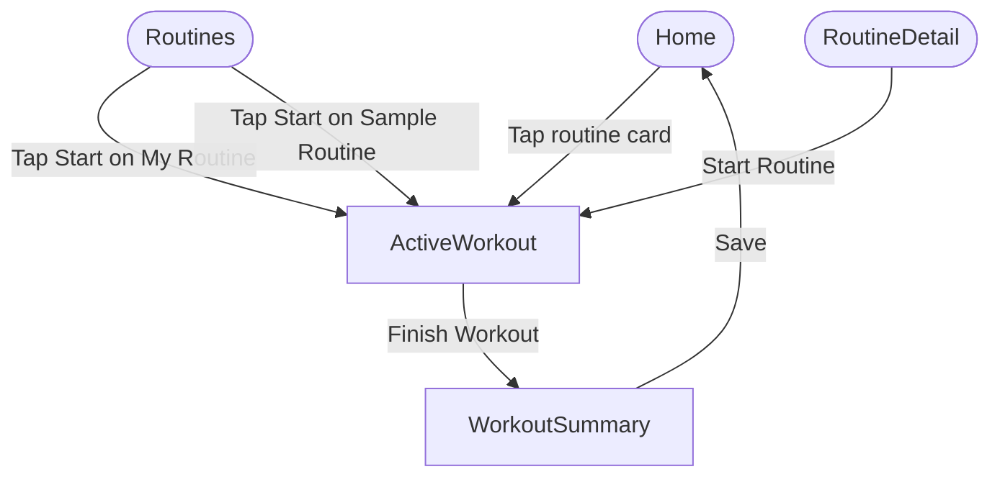
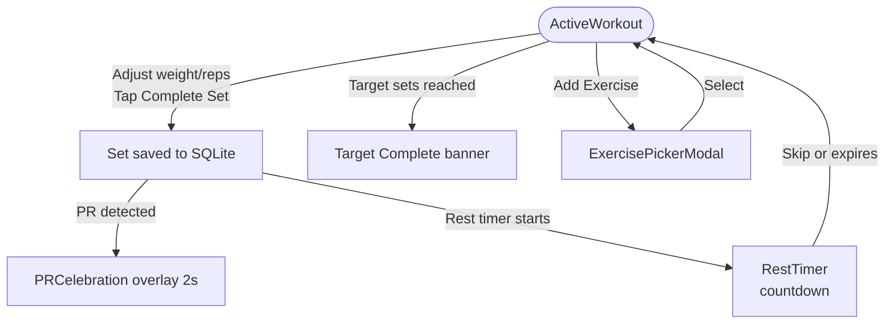
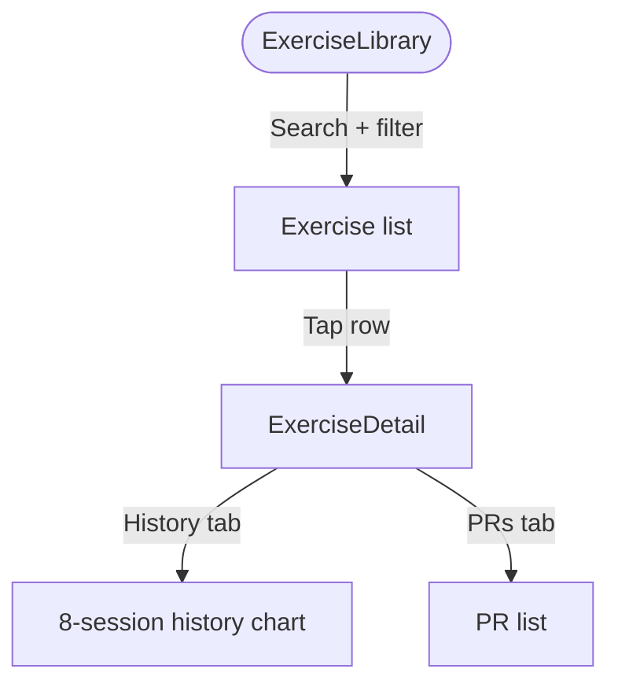
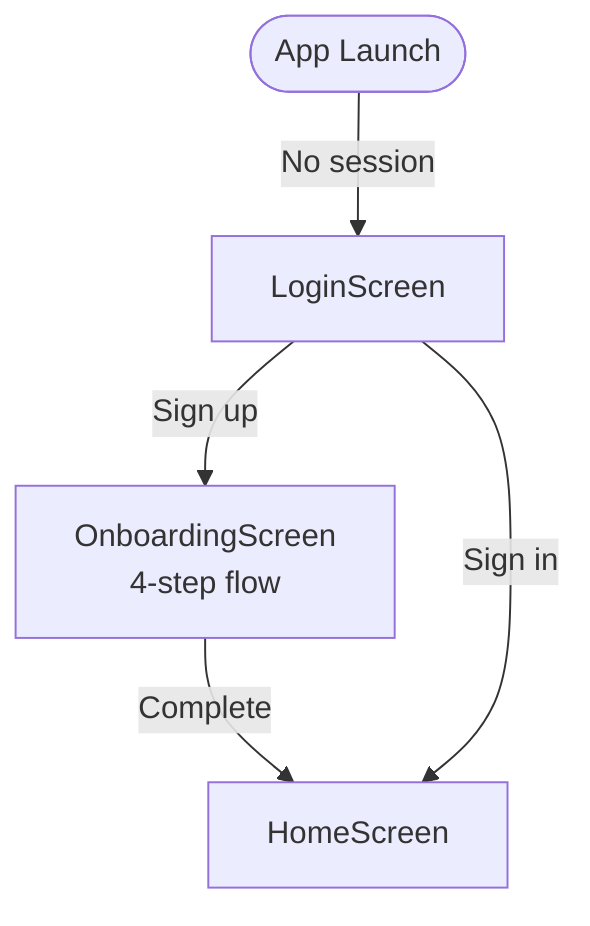
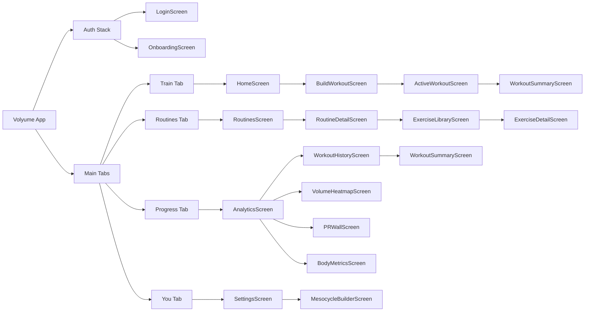

# Volyume — Product UX Map

_Last updated: 2026-05-16. Covers the build as it existed in May 2026 on the now-retired `claude/build-volyume-app-srY9C` branch._

> **Stale relative to current state.** Active branch is now `main`
> (also the GitHub default branch as of 2026-05-26). For the live
> screen inventory, see `HANDOFF.md` section 11 (56 screens). For
> shipped UI surfaces, see `HANDOFF.md` section 4. This doc is
> preserved for the structural diagrams + historical UX rationale;
> refresh as a follow-up when a major surface is reworked.

---

## 1. Tab Structure

| Tab index | Tab label | Tab icon | Root screen | Nested screens |
|-----------|-----------|----------|-------------|----------------|
| 0 | Train | barbell-outline | HomeScreen | BuildWorkoutScreen → ActiveWorkoutScreen → WorkoutSummaryScreen |
| 1 | Routines | list-outline | RoutinesScreen | RoutineDetailScreen → ExerciseLibraryScreen → ExerciseDetailScreen |
| 2 | Progress | stats-chart-outline | AnalyticsScreen | WorkoutHistoryScreen, WorkoutSummaryScreen, VolumeHeatmapScreen, PRWallScreen, BodyMetricsScreen |
| 3 | You | person-outline | SettingsScreen | MesocycleBuilderScreen |

---

## 2. Screen Map

### Tab 0 — Train (HomeStack)

| Route name | File | Purpose |
|------------|------|-------|
| `Home` | `HomeScreen.js` | Dashboard: week stats, active workout CTA, quick nav |
| `BuildWorkout` | `BuildWorkoutScreen.js` | Configure a blank workout (exercises, sets, reps, rest) before starting |
| `ActiveWorkout` | `ActiveWorkoutScreen.js` | Live workout logging |
| `WorkoutSummary` | `WorkoutSummaryScreen.js` | Post-workout summary, feedback, auto-reg recommendations |

### Tab 1 — Routines (RoutinesStack)

| Route name | File | Purpose |
|------------|------|-------|
| `Routines` | `RoutinesScreen.js` | List of My Routines + Sample Routines |
| `RoutineDetail` | `RoutineDetailScreen.js` | View/edit routine exercises, configure per-exercise settings |
| `ExerciseLibrary` | `ExerciseLibraryScreen.js` | Searchable exercise library with muscle/equipment filters |
| `ExerciseDetail` | `ExerciseDetailScreen.js` | Exercise history chart, PRs, notes |

### Tab 2 — Progress (ProgressStack)

| Route name | File | Purpose |
|------------|------|-------|
| `Analytics` | `AnalyticsScreen.js` | Weekly stats overview, deep-dive links, deload warning |
| `WorkoutHistory` | `WorkoutHistoryScreen.js` | Chronological list of completed sessions |
| `WorkoutSummary` | `WorkoutSummaryScreen.js` | *(also registered here)* Post-workout summary (navigated to from history repeat) |
| `VolumeHeatmap` | `VolumeHeatmapScreen.js` | Per-muscle weekly volume bars vs MEV/MAV/MRV |
| `PRWall` | `PRWallScreen.js` | All-time personal records |
| `BodyMetrics` | `BodyMetricsScreen.js` | Bodyweight log + measurements |

### Tab 3 — You (ProfileStack)

| Route name | File | Purpose |
|------------|------|-------|
| `Settings` | `SettingsScreen.js` | Profile, units, preferences, data management |
| `MesocycleBuilder` | `MesocycleBuilderScreen.js` | Create/manage mesocycles |

---

## 3. Intended Corrected Navigation Structure

The following corrections are needed vs current implementation:

| Current (broken) | Corrected | Location |
|------------------|-----------|----------|
| `navigate('RoutineBuilder')` | `navigate('RoutinesTab', { screen: 'Routines' })` | SettingsScreen |
| `navigate('AnalyticsTab', { screen: 'VolumeHeatmap' })` | `navigate('ProgressTab', { screen: 'VolumeHeatmap' })` | SettingsScreen |
| `navigate('ActiveWorkout')` (from ProgressStack) | `navigate('HomeTab', { screen: 'ActiveWorkout' })` | WorkoutHistoryScreen (repeat) |

---

## 4. User Flow Diagrams (Mermaid)

### Flow A — Start Blank Workout

```mermaid
flowchart TD
    Home([Home]) --> BW[BuildWorkout\n"Build Workout"]
    BW -->|"Skip Setup"| AW[ActiveWorkout]
    BW -->|Add exercises, configure, tap\n"Start Training (N)"| AW
    AW -->|Finish Workout| WS[WorkoutSummary]
    WS -->|Save / Discard| Home
```

### Flow B — Start Routine



### Flow C — Browse & Edit Routines

```mermaid
flowchart TD
    Routines([Routines]) -->|Tap exercise row| RD[RoutineDetail]
    Routines -->|Tap "…" → Edit| RD
    Routines -->|Tap "…" → Duplicate| Routines
    Routines -->|Tap "…" → Delete| Routines
    RD -->|Tap exercise row| EL[ExerciseLibrary]
    EL -->|Select exercise| RD
    RD -->|Tap exercise info| ED[ExerciseDetail]
```

### Flow D — Log a Set



### Flow E — Review Progress

```mermaid
flowchart TD
    Analytics([Analytics]) -->|Workout History card| WH[WorkoutHistory]
    Analytics -->|Volume Heatmap card| VH[VolumeHeatmap]
    Analytics -->|PR Wall card| PR[PRWall]
    Analytics -->|Body Metrics card| BM[BodyMetrics]
    WH -->|Tap session| WS[WorkoutSummary\n(read-only)]
    WH -->|Repeat session| AW[ActiveWorkout]
```

### Flow F — Exercise Library



### Flow G — Onboarding



---

## 5. Full Sitemap (Mermaid)



---

## 6. Screen Entry Points Summary

| Screen | How you get there |
|--------|-------------------|
| HomeScreen | Tab press (Train) |
| BuildWorkoutScreen | HomeScreen "Start Blank Workout" |
| ActiveWorkoutScreen | BuildWorkoutScreen "Start Training" or "Skip Setup"; HomeScreen routine card; RoutinesScreen Start button; RoutineDetailScreen "Start Routine"; HomeScreen "Continue Workout" |
| WorkoutSummaryScreen | ActiveWorkoutScreen "Finish Workout"; WorkoutHistoryScreen row tap |
| RoutinesScreen | Tab press (Routines) |
| RoutineDetailScreen | RoutinesScreen row tap; RoutinesScreen "…" Edit |
| ExerciseLibraryScreen | RoutineDetailScreen add exercise; Routines tab (direct link from HomeScreen quick nav) |
| ExerciseDetailScreen | ExerciseLibraryScreen row tap |
| AnalyticsScreen | Tab press (Progress) |
| WorkoutHistoryScreen | AnalyticsScreen card; HomeScreen quick nav History link |
| VolumeHeatmapScreen | AnalyticsScreen card |
| PRWallScreen | AnalyticsScreen card |
| BodyMetricsScreen | AnalyticsScreen card |
| SettingsScreen | Tab press (You) |
| MesocycleBuilderScreen | SettingsScreen |
| LoginScreen | App launch (unauthenticated) |
| OnboardingScreen | LoginScreen sign up |

---

## 7. External Review Questions

These are open questions for external reviewers (design, product, user testing):

1. **"Train" vs "Home"** — The tab is labelled "Train" but the landing screen is a dashboard. Should the tab name better reflect the content, or should the landing screen be replaced with a quick-start workout view?

2. **Two paths to start a workout** — Users can start from (a) the Train tab CTA, (b) a routine card on the Home screen, (c) the Routines tab Start button. Is this discoverability good or confusing?

3. **BuildWorkoutScreen placement** — Is the "Build Workout" configuration screen (sets, reps, rest per exercise) needed before every blank workout, or should it be opt-in (skip by default)?

4. **WorkoutSummary registered in two stacks** — `WorkoutSummary` exists in both HomeStack and ProgressStack. When accessed from History, the back button goes to WorkoutHistory. When accessed post-workout, back goes to Home. Is this correct behaviour?

5. **"Routines" tab name** — "Routines" could imply programming/periodisation. Does this accurately reflect the tab's content (routine browser + exercise library)?

6. **Sample routines prefix** — Sample routines are stored with `[SAMPLE]` prefix in the database and the prefix is stripped on display. Is there a cleaner way to differentiate sample vs user routines (e.g., a `is_sample` column)?

7. **No dedicated exercise log entry point** — There is no way to log a single exercise outside of a workout. Is this intentional?

8. **Deload warning placement** — The deload warning appears on the AnalyticsScreen. Should it also appear on HomeScreen or as a push notification?

9. **PRWall empty state** — On first launch, the PR Wall is empty. Should there be a prompt or example to help users understand what it will show?

10. **Volume heatmap vs Analytics overlap** — AnalyticsScreen shows weekly stats and the VolumeHeatmap is a separate screen. Is there content duplication that should be merged?
